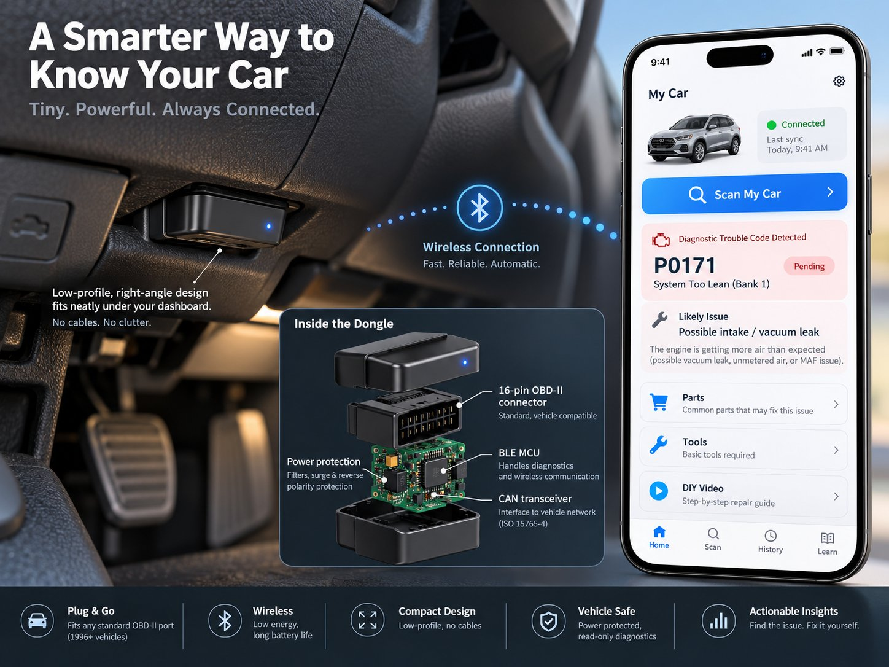

# Hardware BOM — read-only BLE OBD dongle (v1, 2008+ CAN)

Target: a giveaway-cheap, deliberately boring dongle. Read-only by design.

> For the buildable parts list (bench prototype + custom Rev A PCB, transcribed
> from the forwarded hardware build guide), see
> [`hardware/bom.md`](../hardware/bom.md) and the interactive workshop page
> [`hardware/build-guide.html`](../hardware/build-guide.html). This doc is the
> cost model; that one is the shopping/workshop list.

**On the "$3 dongle":** treat $3 as an engineering *target and hypothesis*,
not an established figure — the numbers below are component+assembly
targets at very high volume, before certification, packaging, logistics,
yield loss, and support. The business model does not need exactly $3.00:
the bar that matters is *landed giveaway cost comfortably below lifetime
incremental gross profit per user*. Drive the raw electronics toward $3;
judge the product on the landed economics.

## Target high-volume BOM

| Block | Function | Target cost |
|---|---|---|
| BLE microcontroller | Phone link + allowlist state machine; enough flash for signed OTA firmware | $0.55–0.90 |
| CAN controller/transceiver | ISO 15765-4 physical/data-link; automotive-qualified PHY preferred. **High-impedance diagnostic node only — do NOT add another 120 Ω termination across pins 6/14**; the vehicle bus is already terminated at both ends. | $0.15–0.35 |
| Power/protection | 12–14.4 V → logic rail; reverse-polarity, load-dump/transient protection, sleep mode. Quiescent draw is a first-order spec: a permanently connected dongle spends nearly all its life asleep, and battery drain is one of the earliest things to measure on the bench (target: sleep current low enough that a parked car is unaffected over weeks). | $0.25–0.50 |
| SAE J1962 connector | 16-pin male; pins 4/5 ground, 6/14 CAN, 16 battery | $0.30–0.55 |
| PCB + passives | 2-layer, compact right-angle layout | $0.20–0.40 |
| Enclosure | No cable; compact right-angle, one LED | $0.15–0.30 |
| Assembly + test | SMT, programming, per-unit CAN loopback test | $0.25–0.50 |
| **Target** | | **~$1.85–$3.50** |

## Certification and packaging caveats

These targets are component+assembly only. A real product budget must add:

- **EMC/EMI**: FCC (US), CE/RED (EU), ISED (Canada) — radiated emissions
  from the BLE radio and immunity on a vehicle's 12 V rail.
- **Automotive electrical**: ISO 7637 transients, load dump, jump-start and
  reverse-battery survival; the protection block above is sized for it but
  must be validated per vehicle platform.
- **Safety/regulatory**: UL/cUL or equivalent for a device permanently
  attached to vehicle power; check insurer and retailer requirements.
- **Environmental**: operating −40 °C to +85 °C (parked-car cabin temps),
  vibration, connector mating-cycle life.
- **Packaging, logistics, yield loss, support, retailer distribution** —
  all separate from the BOM and typically larger than the BOM at
  giveaway volumes.
- **Security**: secure element or OTP fuses for the firmware *verification*
  key (the signing private key never leaves the manufacturer) and the
  per-device attestation identity, provisioned on the manufacturing line.

## Bench MVP (M1) shopping list

For the first working prototype you don't need the cost-down board:

1. Any BLE-capable dev board with enough flash for the signed image.
2. An automotive CAN transceiver breakout (3.3 V logic side).
3. An OBD-II breakout cable or a CAN simulator (don't develop on a real
   car until the allowlist tests pass on the bench).
4. The firmware in `firmware/` — run `make test` in `firmware/tests`
   before flashing anything.
